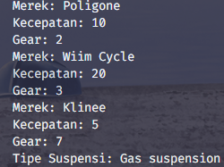

# PRAKTIKUM OOP JOBSHEET 1

Nama : Syahrul Bhudi Ferdiansyah  
NIM : 2241720167  
Kelas : 2F  
Absen : 26  

**Percobaan 1**

- Class Sepeda  
  

- Class sepedaDemo  
  

- Hasil Running  
  

**Percobaan 2**

- Class SepedaGunung  
  

- Tambahan pada Class sepedaDemo  
  

- Hasil Running  
  

**Pertanyaan**

1. Jelaskan perbedaan antara objek dengan class!
   _Jawaban : Class merupakan blueprint atau rangka dari sebuah objek dan juga class bisa berdiri sendiri walau tanpa ada objek, sedangkan objek adalah suatu instansi tunggal dari sebuah class yang memiliki attribut/state dan behaviour/function juga objek tidak dapat berdiri sendiri tanpa adanya blueprint atau class_

2. Jelaskan alasan warna dan tipe mesin dapat menjadi atribut dari objek mobil!
   _Jawaban : Dikarenakan warna dan tipe mesin bisa dijadikan pembeda antara objek yang satu dengan yang lainnya. Dengan memasukkan warna dan tipe mesin sebagai atribut dari objek mobil, objek dapat menyimpan informasi tentang karakteristik visual dan teknis dari mobil tersebut. Informasi ini dapat digunakan untuk mengidentifikasi, membandingkan, atau melakukan operasi terkait dengan mobil._

3. Sebutkan salah satu kelebihan utama dari pemrograman berorientasi objek dibandingkan
   dengan pemrograman struktural!
   _Jawaban : Kelebihan PBO adalah program dapat lebih fleksibel, apabila ada perubahan fitur, maka keseluruhan program tidak akan terganggu. Salah satu kelebihan utama pemrograman berorientasi objek dibandingkan dengan pemrograman struktural adalah konsep pewarisan (inheritance). Pewarisan memungkinkan objek atau kelas untuk mewarisi properti dan metode dari objek atau kelas lain yang lebih umum atau "induk"._

4. Apakah diperbolehkan melakukan pendefinisian dua buah atribut dalam satu baris kode seperti
   “public String nama,alamat;”?
   _Jawaban : Diperbolehkan asalkan memiliki tipe data yang sama_

5. Pada class SepedaGunung, jelaskan alasan atribut merk, kecepatan, dan gear tidak lagi ditulis di
   dalam class tersebut!
   _Jawaban : Karena pada class SepedaGunung sudah mewarisi seluruh attribut dan function dari class induknya maka dari itu tidak perlu lagi menuliskan attribut lagi_

**Praktikum**

1.  - Class Mahasiswa  
        
      attribut : Nama, Nim, Kelas, IPK  
      Method : Constructor, print, setIPK, getIPK
      - Class Nilai Extends Mahasiswa  
          
        attribut : UTS, UAS, kuis, tugas  
        method : Constructor, calcIPK, getPredikat
      - Class matkul Extends Mahasiswa  
          
        attribut : Array namaMatkul, Array id, Array sks  
        method : Constructor, print
      - Class Hewan  
          
        attribut : nama, jenis , habitat  
        Method : Constructor, bersuara, eat, print
      - Class Kucing Extend Hewan  
          
        attribut : bulu , ras, warna, Energy  
        method : Constructor, setEnergy, bermain, tidur, makan, printKcng
      - Class Laptop  
          
        attribut : merk, proci, vga, ram, rom, price, baterai, stok  
        method : Constructor, print, getStok, buyLaptop
